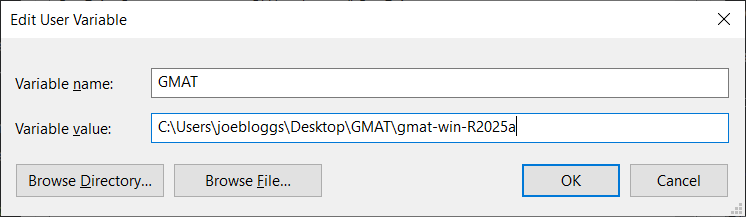

# GMAT-Python-simple

An extra wrapper library for the GMAT Python API to simplify setting up mission simulations. The wrapper aims to align
Python
commands with GMAT script ones, greatly reducing the number of lines required to model a mission. To do this, it
automatically creates relevant subclasses and sets default values, while still allowing the user full control over
parameters if they need something specific. The aim is to reduce the time that the user needs to spend thinking about
how the API works, so they can instead focus on the orbital mechanics and broader design of their particular mission.

Due to the library's extensive use of classes and methods rather than strings, it also supports full code completion. It
has been designed to be as intuitive as possible for the user, while still closely matching GMAT's design philosophy.

## Compatibility

The library itself should be compatible with Python 3.9 to 3.14. If you find any incompatibilities, please raise an
[issue](https://github.com/weasdown/GMAT-Python-simple/issues). However, out of the box, GMAT R2025a supports only
Python 3.9 to 3.12. This means that **without adding extra plugins to your GMAT install, this library can only be used
with Python 3.9 to 3.12.** You can find the required plugins and instructions on how to install them in the
[plugins](plugins) directory.

## Getting Started

[//]: # (TODO: remove TestPyPI specifying)
You can install this library with:

`pip install -i https://test.pypi.org/simple/ gmat-py-simple`

Then in your Python scripts, import the library:

```python
import gmat_py_simple as gp
```

`gp` is the recommended abbreviation as is used throughout this
documentation.

### Specifying GMAT path

[//]: # (TODO: add link to instructions for specifying GMAT path)
For this library to be able to communicate with GMAT, you will also need to specify the path that GMAT is installed in.
You can do this either using an environment variable or in a configuration file. As an example, we'll assume that your
path to GMAT is `C:\Users\joebloggs\Desktop\GMAT\gmat-win-R2025a` on Windows, or
`/home/joebloggs/Desktop/GMAT/gmat-win-R2025a` on Linux or macOS.

[//]: # (TODO: add instructions for path specifying via environment variable or config file.)

#### Environment variable

Create an environment variable called "GMAT" with its value set to the path to the GMAT folder.

<details> <summary><b>Windows</b></summary>
You can set the environment variable as either a user variable or system variable - we recommend a user variable.

To set it, open the Start menu, start typing "environment" and click the option for `Edit the system environment 
variables` (shown below).


A window will appear: click the `Environment Variables...` button at the bottom. Then, either under the user variables
section at the top, or system variables section at the bottom, click `New...` to specify a new variable. Then enter
"GMAT" as the name and your path to GMAT's root folder as the value.


</details>

<details> <summary><b>Linux</b></summary>
On Linux, to set the environment variable for just your current session, run the following in the command line:

```bash
export GMAT="/path/to/GMAT"
```

For our example path, this would be:

```bash
export GMAT="/home/joebloggs/Desktop/GMAT/gmat-win-R2025a"
```

To set the variable permanently, add the line above to your `~/.bash_profile` or `~/.bashrc` file.
</details>

[//]: # (TODO add environment variable instructions for macOS)

## Examples

The [`examples`](examples) directory gives several example scripts that demonstrate the power of this library (and GMAT
generally). GMAT has several tutorials built-in, supplied in its `[GMAT root]/samples` folder. The scripts in
[`examples/tutorials`](examples/tutorials) have exactly the same functionality as these, but have been written using
this library rather than GMAT's standard Python API or its scripting language. Tutorials 1 to 4 are currently
implemented, with the rest planned to be added in future once the library has the required features.

[//]: # (TODO: update above paragraph once more tutorials implemented.)

[//]: # (<details> <summary><b>Pre-fix</b></summary>)

[//]: # ()

[//]: # (**On 19/4/25, NASA released [GMAT-R2025a]&#40;https://sourceforge.net/projects/gmat/&#41;. This wrapper was 
developed and tested)

[//]: # (with R2022a, so while I expect everything to still work, I cannot guarantee it. If you find any parts that 
don't work)

[//]: # (with R2025a, please raise an [issue]&#40;https://github.com/weasdown/GMAT-Python-simple/issues&#41;.**)

[//]: # ()

[//]: # (## Components implemented so far)

[//]: # ()

[//]: # (* Spacecraft - mostly complete: not all fields settable with from_dict&#40;&#41; but all settable with 
SetField&#40;&#41;)

[//]: # (    * Tanks - complete)

[//]: # (    * Thrusters - complete)

[//]: # (* ImpulsiveBurn - complete)

[//]: # (* Propagate command - mostly complete)

[//]: # (    * StopCondition - tested so far: ElapsedSecs, ElapsedDays, Apoapsis, Periapsis)

[//]: # ()

[//]: # (## WIP components)

[//]: # ()

[//]: # (* Maneuver command)

[//]: # (* FiniteBurn)

[//]: # ()

[//]: # (</details>)